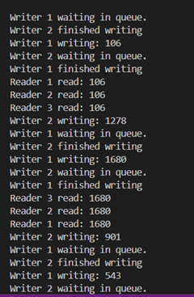

# ReaderwriterProblem
Java implementation of the Reader-Writer Problem, showcasing thread synchronization using semaphores. Multiple readers can read the shared resource simultaneously, while writers require exclusive access. Ensures data consistency, avoids race conditions, and demonstrates real-world scenarios like concurrent database access.
# Reader-Writer Problem (Java)

This repository contains a Java implementation of the Reader-Writer Problem using multithreading and semaphores.

## Problem Description
The Reader-Writer problem is a synchronization challenge where:
- Multiple readers can read a shared resource simultaneously.
- Writers require exclusive access to the resource to ensure data consistency.

## Key Features
- **Readers**: Can read concurrently.
- **Writers**: Require exclusive access to the shared resource.
- Uses **semaphores** to manage access and ensure synchronization.

## Prerequisites
- Java Development Kit (JDK) 8 or higher.

## How to Run
1. Clone the repository:
   ```bash
   git clone https://github.com/username/Reader-Writer-Problem-Java.git
   cd Reader-Writer-Problem-Java
## Output

